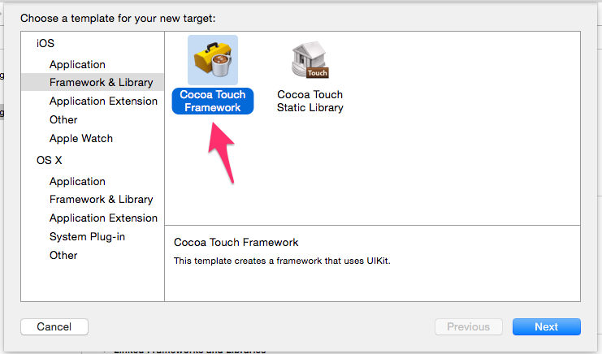
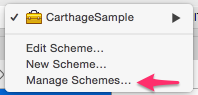
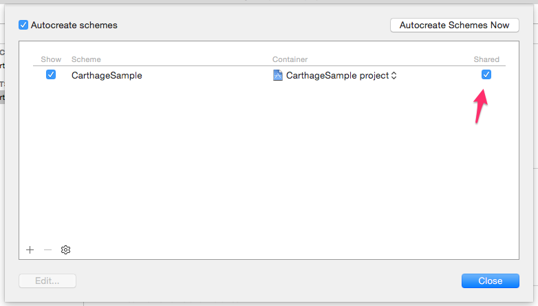

# CarthageSample

Sample for publishing with [Carthage](https://github.com/Carthage/Carthage).

### 0. Create Xcode project or workspace at the root directory

```bash
.
├── CarthageSample
├── CarthageSample.xcodeproj
└── CarthageSample.xcworkspace
```

### 1.Add target for framework



### 2. Make Scheme shared





### 3. Check building

```bash
$ carthage build --no-skip-current
```

Build with command above and check inside `Carthage/Build`.

### 4. git push

No problem? Then commit your changes and push it to github.

### 5. tag

Click release and add new tag for your commit.


### 6. done

Use with `carthage` from another project!

## How to install this sample repository

```bash
$ brew update
$ brew install carthage
$ cd /to/your-project-root/
$ vi Cartfile
# Write one line below.
github "morizotter/CarthageSample"
$ carthage update
```

1. On your application targets’ “General” settings tab, in the “Linked Frameworks and Libraries” section, drag and drop each framework you want to use from the [Carthage/Build][] folder on disk.
1. On your application targets’ “Build Phases” settings tab, click the “+” icon and choose “New Run Script Phase”. Create a Run Script with the following contents:

  ```sh
  /usr/local/bin/carthage copy-frameworks
  ```

  and add the paths to the frameworks you want to use under “Input Files”, e.g.:

  ```
  $(SRCROOT)/Carthage/Build/iOS/CarthageSample.framework
  ```

  This script works around an [App Store submission bug](http://www.openradar.me/radar?id=6409498411401216) triggered by universal binaries.

Open your project and write `import CarthageSample` at the top of swift file where you want to test this sample. And write:

```swift
let sample = Sample()
sample.log() // sample
```

Done.
